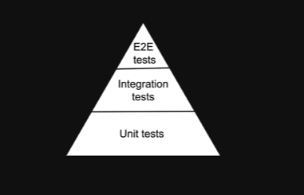

# Introduction

#### Testing

- As a developer ,our primary goal is to build software that works

- To ensure our software works ,we test the application

- We check if our software works as expected

#### Manual Testing

- An individual will open the website , interact with the website and ensure everything works as intended

- If a new feature is released , we repeat the same steps

- We may have to test not only the new feature but also the existing features

#### Drawbacks of Manual Testing

- Time Consuming

- Complex repetitive tasks has a risk of human error

- We may not get a chance to test all the features

#### Automated Testing

- Automated tests are programs that automate the task of testing our software

- Write code to test the software code

- Additional effort required when we develop a feature

#### Advantages of Automated Testing

- Not time consuming

- Reliable , consistent and not error prone

- Easy to identify and fix features that breaks tests

- Gives confidence when shipping software

#### Course Structure

- Jest and React Testing Library

- Fundamentals of writing a test

- Test components with user interactions

- Test components wrapped in a provider

- Test components with mocking

- Static analysis testing 

# Jest vs React Testing Library

#### Jest

- Jest is a javascript testing framework

- Jest is a test runner that finds tests ,runs the tests ,determines whether the tests passed or failed and reports it back in a human readable manner

#### React Testing Library

- Javascript testing utility that provides virtual DOM for testing React components

- React Testig Library provides a virtual DOM which we can use to interact with and verify the behavior of a react component

- Testing Library is a family of packages which helps test UI components

- The core Library is called DOM Testing library and RTL is simply a wrapper around this core libarry to test React applications in a easier way

# Types of Tests

There are 3 types of test 

- Unit tests

- Integration tests

- E2E tests

#### Unit Tests

- Focus is on testing the individual building blocks of an application such as a class or a function or a component

- Each unit or building block is tested in isolation , indepndent of other units

- Dependencies are mocked

- Run in a short amount of time and make it very easy to pinpoint failures

- Relatively easier to run and maintain

#### Integration tests

- Focus is on testing a combination of units and ensuring they work together

- Take longer than unit tests

#### E2E tests

- Focus is on testing the entire application flow and ensuring it works as designed from start to finish

- Involves a real UI , a real backend database ,real services etc

- Take the longest as they cover the most amount of code

- Have  a cost implication as we intercat with real APIs that may charge based on the number of requests

#### Testing Pyramid

#### RTL Philosophy

- The more your tests resembe the way our software is used , the more confidence they can give us

- With React Testing Library , we are not concerned about the implementation details of a component

- We are testing how the component behaves when a user interacts with it

- RTL will not care if we add 4+4 or 5+3 to display the number 8

- Refactoring will not affect our test as log as the end result is the same

- RTL strikes a balance between unit and E2E tests which is what we will be learning in the rest of the series

# Anatomy of a Test

**test(name,fn,timeout)**

- The first argument is the test name used to identify the test

- The second argument is a function that contains the expectations to test

- The third argument is timeout which is an optional argument for specifying how long to wait before aborting the test .The default timeout value is 5 seconds

# Test Driven Development

- Test driven development is a software development process where we write tests before writing the software code

- Once the tests have been written ,we then write the code to ensure the tests pass
  
  - Create tests that verify the functionality of a specific feature
  
  - Write software code that will run the tests succesfully when re-executed
  
  - Refactor the code for optimization while ensuring the tests continue to pass
  
  Note => Also called red-green testing as all tests go from a red failed state to a green passed state

# Jest Watch Mode

- Watch mode is an option that we can pass to Jest asking to watch files that have changed since the last commit and execute tests related only to those changed files

- An optimization designed to make our tests run fast regardless of how many tests we have

# Grouping Tests

**describe(name,fn)**

The first argument is the group name

The second argument is a function that contains the expectations to test

# Filename Conventions

- Files with .test.js or .test.tsx suffix

- Files with .spec.js or .spec.tsx suffix

- Files with .js or .tsx suffix in `__tests__` folders  

Recommendation is to always put or tests next to the code they are testing so that relative imports are shorter

# Code Coverage

A metric that can help us understand how much of our software code is tested 

- Statemement Coverage : how many of the statements in the software code have been executed

- Branches Coverage: how many of the branches of the control structures (if statements for instance) have been executed

- Function Coverage: how many of the functions defined have been called

- Line coverage : how many lines of source code have been tested

# Assertions

- When writing tests , we often need to check that values meet certain conditions 

-  Assertions decide if a test passes or fails

expect(value)

- The argument should be the value that our code produces

- Typically ,we will use expect along with a "matcher" function to asser something about a value

- A matcher can optionally accept an argument which is the correct expected value

# What to test ?

- Test component renders

- Test  component renders with props

- Test component renders in different states

- Test component reacts to events

# What not to test ?

- Implementation details

- Third party code

- Code that is not important from a user point of view

# RTL Queries

Every test we write generally involves the following basic steps

1. Render the component

2. Find an element rendered by the component

3. Assert against the element found in step 2 which will pass or fail the test

To render the component , we use the render method from RTL

For assertion , we use expect passing in a value and combine it with a matcher function from jest or jest-dom

Queries are the methods that Testing Library provides to find elements on the page

To find a single element on the page , we have 

- getBy..

- queryBy..

- findBy..

To find multiple elements on the page  , we have

- getAllBy.. 

- queryAllBy..

- findAllBy..

The suffx can be one of Role,LabelText,PlaceHolderText,Text, DisplayValue,AltTest,Title and finally TestId

#### getBy... queries

- getBy.. class of queries return the matching node for a query , and throw a descriptive error if no elements match or if more than one match is found 

- The suffx can be one of Role,LabelText,PlaceHolderText , Text ,DisplayValue,AltTest , Titl and finally TestId

#### getByRole

- getByRole queries for elements with the given role 

- Role refers to the ARIA(Accessible Rich Internet Applications) role which provides semantic meaning to content to ensure people using assistive technologies are able to use them

- By default ,many semantic elements in HTML have a role

- Button elements has a button role, anchor element has a link role, h1 to h6 elements have a heading role, checkboxes have a checkbox role,radio buttons have a radio role and so on 

- If we are working with elements that do not have a default role or if we want to specify a different role, the role attribute can be used to add the desired role

- To use an anchor element as a button in the navbar , we can add role="button"

